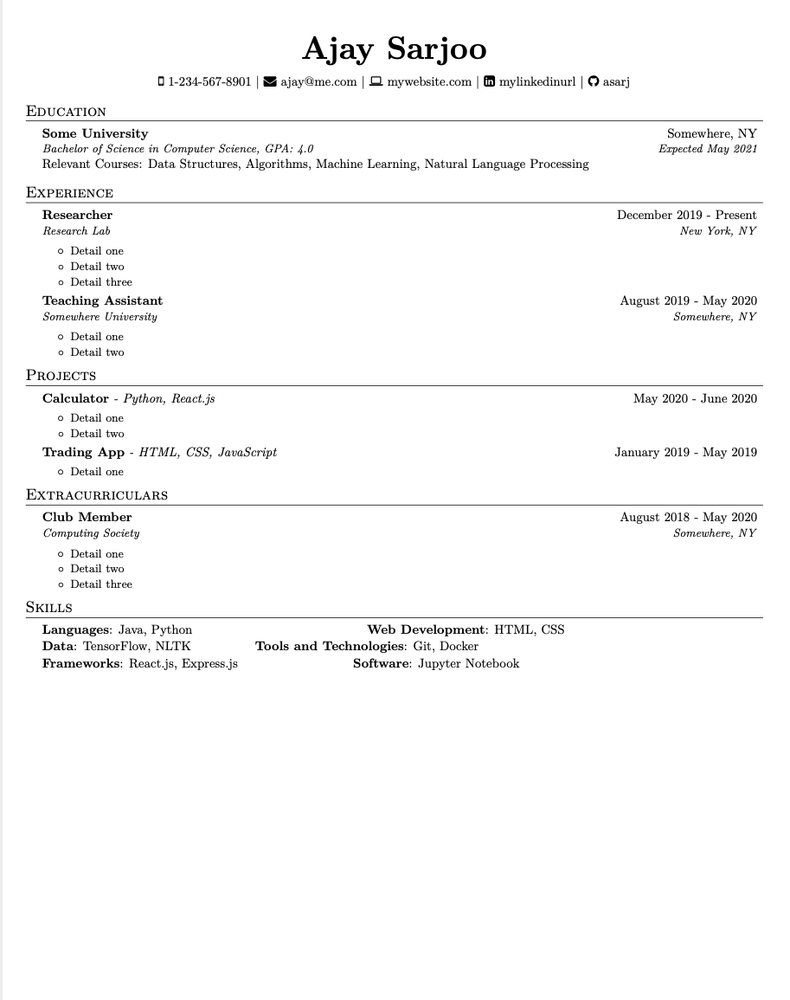
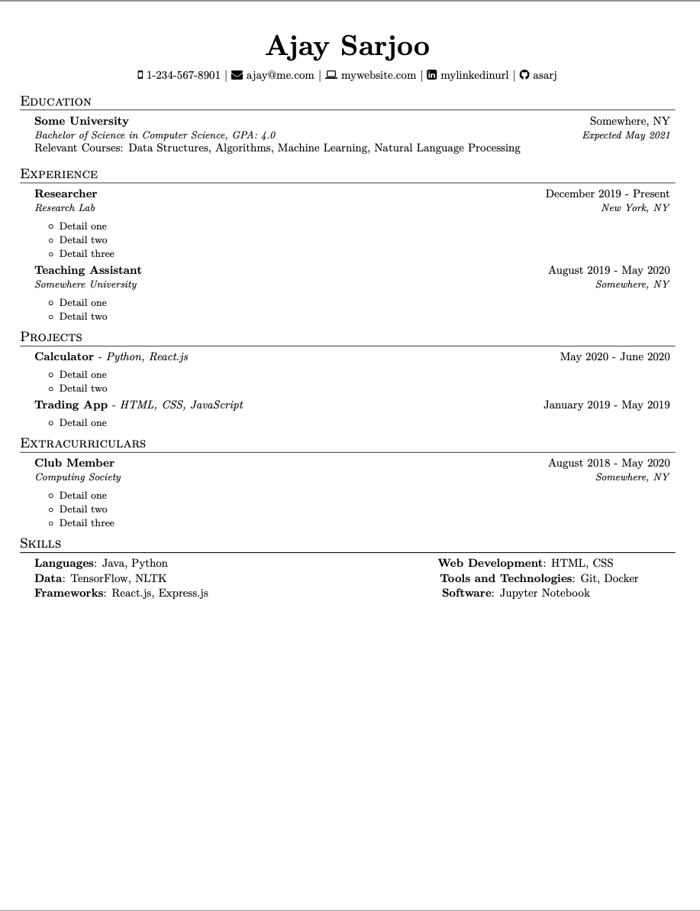
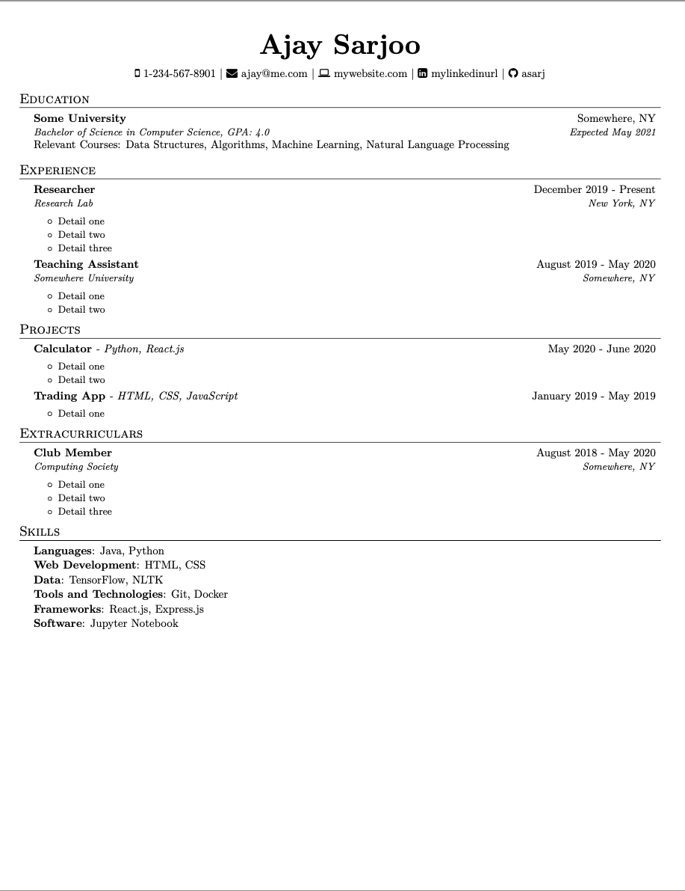

# ResumeGenerator
A Python script to generate a beautiful CS resume in the style of [Ajay Sarjoo](https://www.ajaysarjoo.com/cv)

This program requires that you supply a `.txt` file containing your resume information. This will need to be formatted in a specific way, as specified in the [Text File Specs](#text-file-specification)  
You should also have basic knowledge of LaTeX syntax before using this program

## Text File Specification
The text file you supply to the program requires 6 parts.  
You will need to specify all 6, even if some sections don't pertain to you. If there is a section that doesn't apply to you, write the word `blank` under that section. **If the text file does not conform to the specifications, it will not generate**

### General Structure  
For a general structure of what the text file should look like, take a look at the `example.txt` file in the repo. **Note that every section must be separated by two (2) newlines otherwise IT WILL NOT GENERATE.**  

#### Example.txt
```text

---------------------------------------
BASICS
---------------------------------------
Ajay Sarjoo
1-234-567-8901
ajay@me.com
http://mywebsite.com
https://linkedin.com/in/mylinkedinurl/
https://github.com/asarj


---------------------------------------
EDUCATION
---------------------------------------
Some University -- Somewhere, NY
* Expected May 2021
* Bachelor of Science in Computer Science
* Cumulative GPA: 4.0
* Relevant Courses: Data Structures, Algorithms, Machine Learning, Natural Language Processing


---------------------------------------
EXPERIENCE
---------------------------------------
Researcher -- Research Lab -- New York, NY -- December 2019 - Present
* Detail one
* Detail two
* Detail three

Teaching Assistant -- Somewhere University -- Somewhere, NY -- August 2019 - May 2020
* Detail one
* Detail two


---------------------------------------
PROJECTS
---------------------------------------
Calculator -- Python, React.js -- May 2020 - June 2020
* Detail one
* Detail two

Trading App -- HTML, CSS, JavaScript -- January 2019 - May 2019
* Detail one


---------------------------------------
EXTRACURRICULARS
---------------------------------------
Club Member -- Computing Society -- Somewhere, NY -- August 2018 - May 2020
* Detail one
* Detail two
* Detail three


---------------------------------------
LANGUAGES AND TECHNOLOGIES
---------------------------------------
LANGUAGES
Java, Python

WEB DEVELOPMENT
HTML, CSS

DATA
TensorFlow, NLTK

TOOLS AND TECHNOLOGIES
Git, Docker

FRAMEWORKS
React.js, Express.js

SOFTWARE
Jupyter Notebook
```

#### Basics Section
The basics section supplies the header information on your resume. This would include your name, email, LinkedIn account information, and others. It would look something like this:  
```text

---------------------------------------
BASICS
---------------------------------------
[Insert name here]
[Insert phone number here]
[Insert email here]
[Insert website url here]
[Insert linkedin url here]
[Insert github url here]
```

If you don't wish to supply a phone number, website, or github, you can write the word `blank` in those places and specify the corresponding flags to omit this information


#### Education Section
The education section supplies the information about where you went to school. It would look something like this:
```text

---------------------------------------
EDUCATION
---------------------------------------
[Insert university name here] -- [Insert university location here]
* [Insert expected graduation date or dates attended here] (ex: Expected May 2021, August 2017 - May 2021)
* [Insert degree here]
* Cumulative GPA: [Insert GPA here]
* Relevant Courses: [Insert courses here]
```
If you don't wish to supply your relevant coursework, you can write the word `blank` in those places and specify the corresponding flags to omit this information


#### Experience Section
The experience section supplies the information about your work history. It would look something like this:
```text

---------------------------------------
EXPERIENCE
---------------------------------------
[Insert position title here] -- [Insert company here] -- [Insert position location here] -- [Insert dates worked here]
* [Insert detail here]
* [Insert detail here]
* [Insert detail here]

[Insert position title here] -- [Insert company here] -- [Insert position location here] -- [Insert dates worked here]
* [Insert detail here]
* [Insert detail here]
* [Insert detail here]
```
Note that each position **MUST** be separated by a space, and listed in reverse chronological order (most recent experience to least recent). You can have as many experiences as you want in this section, provided that you separate each one with a space as listed here


#### Projects Section
The projects section is where you would mention the things you've worked on and to what capacity. It would look something like this:
```text

---------------------------------------
PROJECTS
---------------------------------------
[Insert project name here] -- [Insert languages/frameworks used here] -- [Insert dates spent working on this project here]
* [Insert detail here]
* [Insert detail here]

[Insert project name here] -- [Insert languages/frameworks used here] -- [Insert dates spent working on this project here]
* [Insert detail here]
* [Insert detail here]

```
Note that each project **MUST** be separated by a space, and listed in reverse chronological order (most recent project to least recent). You can have as many projects as you want in this section, provided that you separate each one with a space as listed here. If you don't wish to include the project dates, simply write `blank` in the space where it says `[Insert dates spent working on this project here]` and specify the appropriate flag during program execution


#### Extracurriculars Section
The extracurriculars section is where you would specify the hobbies/volunteer work that you are involved in. Similar to the [Experience Section](#Experience), it would look something like this:
```text

---------------------------------------
EXTRACURRICULARS
---------------------------------------
[Insert position title here] -- [Insert organization here] -- Insert position location here] -- [Insert dates worked here]
* [Insert detail here]
* [Insert detail here]
* [Insert detail here]
* [Insert detail here]

```
Note that each position **MUST** be separated by a space, and listed in reverse chronological order (most recent experience to least recent). You can have as many extracurriculars as you want in this section, provided that you separate each one with a space as listed here


#### Skills Section
The skills section is where you would specify the languages/frameworks/libraries that you know. It would look something like this:
```text

---------------------------------------
LANGUAGES AND TECHNOLOGIES
---------------------------------------
LANGUAGES
[Insert languages here, separated by commas (ex: Java, Python)]

WEB DEVELOPMENT
[Insert web dev languages here, separated by commas (ex: HTML, CSS)]

DATA
[Insert ML libraries here, separated by commas (ex: TensorFlow, PyTorch)]

TOOLS AND TECHNOLOGIES
[Insert tools here, separated by commas (ex: Git, Docker)]

FRAMEWORKS
[Insert frameworks here, separated by commas (ex: React, Angular)]

SOFTWARE
[Insert software here, separated by commas (ex: Jupyter Notebook, PyCharm)]
```


## Program Usage
```bash
usage: resume_generator.py [-h] -i INPUT -o OUTPUT
                           [-resume-filename RESUME_FILENAME] [--no-gpa]
                           [--no-coursework] [--no-phone] [--no-website]
                           [--no-github] [--no-experience] [--no-projects]
                           [--no-project-dates] [--no-extracurriculars]
                           [--keep-tex]
```

### Arguments to Specify
```bash

  -h, --help            show this help message and exit
  -i INPUT, --input INPUT
                        The text file used for generating the resume from. Accepts relative and absolute paths.
  -o OUTPUT, --output OUTPUT
                        The output destination for all generated files (MUST
                        BE A DIRECTORY). Accepts relative and absolute paths.
  -resume-filename RESUME_FILENAME
                        The name of the output file (DO NOT INCLUDE FILE
                        EXTENSION)
  --no-gpa                  Flag to remove GPA from the resume
  --no-coursework           Flag to remove coursework from the resume
  --no-phone                Flag to remove phone number from the resume
  --no-website              Flag to remove website link from the resume
  --no-github               Flag to remove Github link from the resume
  --no-experience           Flag to remove experience from the resume
  --no-projects             Flag to remove projects from the resume
  --no-project-dates        Flag to remove project durations from the resume
  --no-extracurriculars     Flag to remove extracurriculars from the resume
  --keep-tex                Flag to keep the .tex file from resume generation

```


## Demo
If we wanted to create a resume based off of `example.txt`, I can run the following command
```bash
python3 resume_generator.py -i "./example.txt" -o "./readme-material/" -resume-filename "example" 
```

And we will get the following output  


The skills section looks a bit disorganized and could definitely use better alignment. We can re-run the script to keep the .tex file so that we can edit it
```bash
python3 resume_generator.py -i "./example.txt" -o "./readme-material/" -resume-filename "example" --keep-tex
```

Taking a closer look at the LaTeX code for the Skills section, we can see that the `hbox to ` line measurements don't align. 

```latex
%-----------SKILLS-----------------
\section{Skills}
\resumeSubHeadingListStart
    \itemsep-0.3em
     \item[]{
             \textbf{Languages}{: Java, Python}
             \noindent\hbox to 0.225 \textwidth{}
             \textbf{Web Development}{: HTML, CSS}
     }
    \itemsep-0.3em
     \item[]{
         \textbf{Data}{: TensorFlow, NLTK}
             \noindent\hbox to 0.075 \textwidth{}
             \textbf{Tools and Technologies}{: Git, Docker}
     }
    \itemsep-0.3em
     \item[]{
         \textbf{Frameworks}{: React.js, Express.js}
         \noindent\hbox to 0.145 \textwidth{}
             \textbf{Software}{: Jupyter Notebook}
     }
\resumeSubHeadingListEnd
```
At this point we can do two things:
1. Adjust the `hbox to` values so that they align. In this case, change 0.225 to 0.4, 0.075 to 0.405, and 0.145 to 0.345. Making these edits makes the resume look more aligned and neat 
2. Edit the LaTeX code for the skills section to display each category on one line, like so 
    ```latex
    \section{Skills}
        \resumeSubHeadingListStart
            \itemsep-0.3em
            \item[]{
                 \textbf{Languages}{: Java, Python}
            }
            \itemsep-0.3em
            \item[]{
                \textbf{Web Development}{: HTML, CSS}
            }
            \itemsep-0.3em
            \item[]{
                \textbf{Data}{: TensorFlow, NLTK}
            }
            \itemsep-0.3em
            \item[]{
            \textbf{Tools and Technologies}{: Git, Docker}
            }
            \itemsep-0.3em
            \item[]{
                \textbf{Frameworks}{: React.js, Express.js}
            }
            \itemsep-0.3em
            \item[]{
                \textbf{Software}{: Jupyter Notebook}
            }
    \resumeSubHeadingListEnd
    ```
    Which will end up rendering like this 
    
In either case, this will require a re-compilation of the `.tex` file which the application currently does not support. However, if you have `lualatex` installed, it's a matter of running
```bash
lualatex example.tex
```

to regenerate the PDF file.


## To-Do
- Add dynamic alignment for the skills section
- Selective content generation (instead of command line flags)
- Making a GUI version of this application
- Code refactoring for clarity